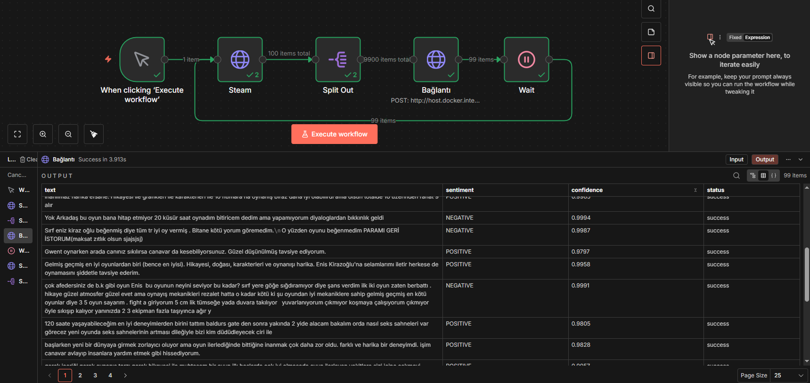

# Steam Review Sentiment Analysis & Automation

## About the Project
This project automatically fetches game reviews from Steam and uses AI (a Turkish BERT model) to analyze whether the reviews are positive or negative. The whole process is automated using **n8n** and runs on a local **FastAPI** Python server.

## How It Works

1. **Fetch Data:** n8n connects to the Steam API to download user reviews.
2. **Extract:** The workflow extracts the exact review text from the Steam data.
3. **AI Analysis:** The text is sent to my local FastAPI server. A Hugging Face model (`bert-base-turkish-sentiment-cased`) analyzes the emotion of the text.
4. **Automation Loop:** n8n uses a loop (cursor) to automatically fetch and analyze thousands of reviews without stopping.

## Tech Stack
* **Language:** Python 3
* **API Server:** FastAPI, Uvicorn
* **AI / Machine Learning:** Hugging Face Transformers (BERT)
* **Automation:** n8n

## How to Run
1. Install required Python libraries: 
   `pip install -r requirements.txt`
2. Start the local server: 
   `uvicorn sentiment_api:app --host 0.0.0.0 --port 8000`
3. Import the `.json` workflow file into your n8n and click "Execute".
